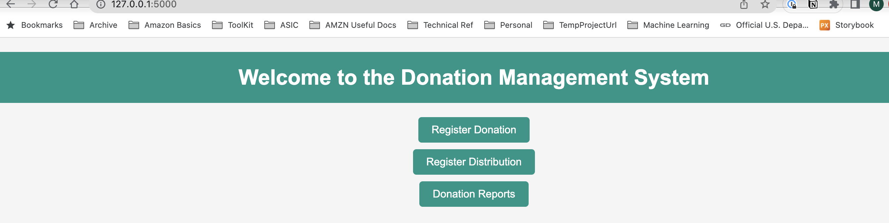
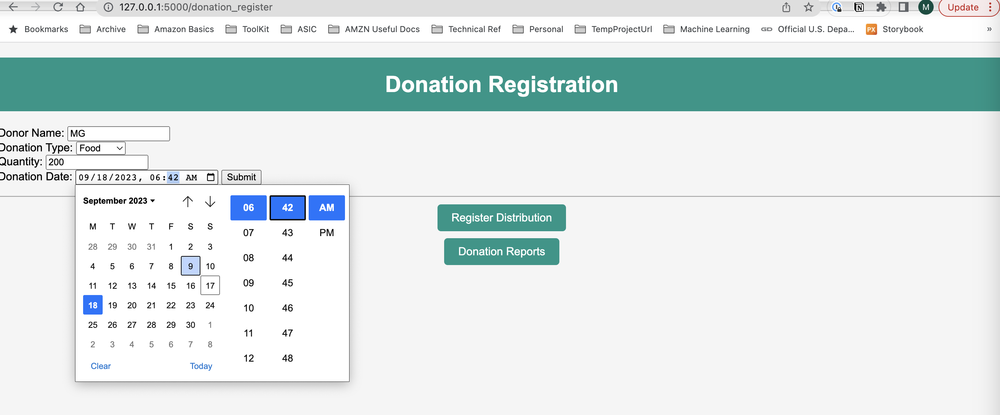
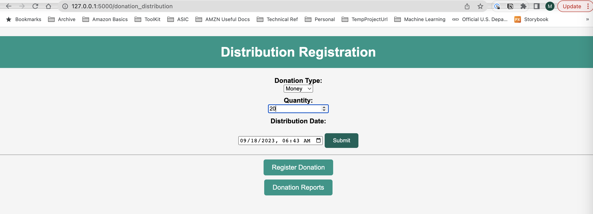
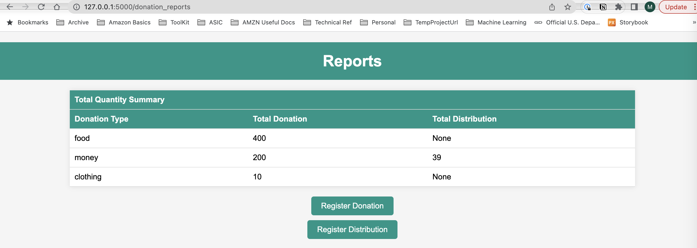

# open-seattle-donation-exercise

## Architecture

This is Web Application Using [Flask](https://flask.palletsprojects.com/en/2.3.x/) and [SQLite](https://sqlite.org/index.html) in Python 3. [SQLAlchemy](https://www.sqlalchemy.org/) is used as a Python SQL toolkit to connect to SQLite

## Web Application Summary

**home** page provides navigation links to other pages


**donation registeration** enables user to record a donation, including donation type (drop down list including money, food, clothing, and other, donation quantity, and the date of the donation (default is local time).


**distribution registration** similar to donation registeration, except for it's used to record a donation distribution with details.


**reports** summary of total donation quantity/distribution quantity by donation type for all records.


## Run app in development server

```
# set up virtual environment
python3 -m venv .venv
. .venv/bin/activate
pip install -r requirements.txt

# run app in development server
flask --app main run --debug

# open local host in a browser and explore pages
http://127.0.0.1:5000/
http://127.0.0.1:5000/donation_register
http://127.0.0.1:5000/donation_distribution
http://127.0.0.1:5000/donation_reports

# optional, if you have trouble seeing the pages, close idle sockets using chrome://net-internals/#sockets

```

## If we want to productionize this using AWS services

1. Donation Registration and Distribution Web Pages.
2. Database: Aurora. DynamoDB is an alternative, but it's not great if we need near-real time analysis with aggregations.
3. Authentication and Authorization: Amazon Cognito. This service provides user pools and identity pools for secure access control.
4. API Gateway: API Gateway endpoints to expose the Lambda functions as RESTful APIs. Use API Gateway's integration with Cognito to secure the APIs and restrict access to authorized users.
5. Storage: S3.
6. Monitoring and Logging:CloudWatch
7. Deployment: CDK
8. Frontend: AWS Elastic Beanstalk or AWS Amplify. This frontend will interact with the API Gateway endpoints.
9. Security: follow best practics, e.g. encryption at rest and in transit, AWS Identity and Access Management (IAM), and AWS Key Management Service (KMS)
10. Scalability: AWS Lambda and DynamoDB automatically scale with traffic, ensuring the system can handle varying donation activity.
11. Backup and Disaster Recovery:
    Enable database regular backup and point-in-time recovery. S3 versioning. Create a disaster recovery plan.
12. Cost Optimization: Monitor and optimize costs using AWS Cost Explorer and consider using AWS Budgets and Cost Allocation Tags to manage expenses effectively.
13. Reporting: Web page querying database for real-time reporting. For offline analysis, can use S3->Datlake (Glue catalog, Lakeformation), -> Athena query -> Quicksight dashboard, etc.
